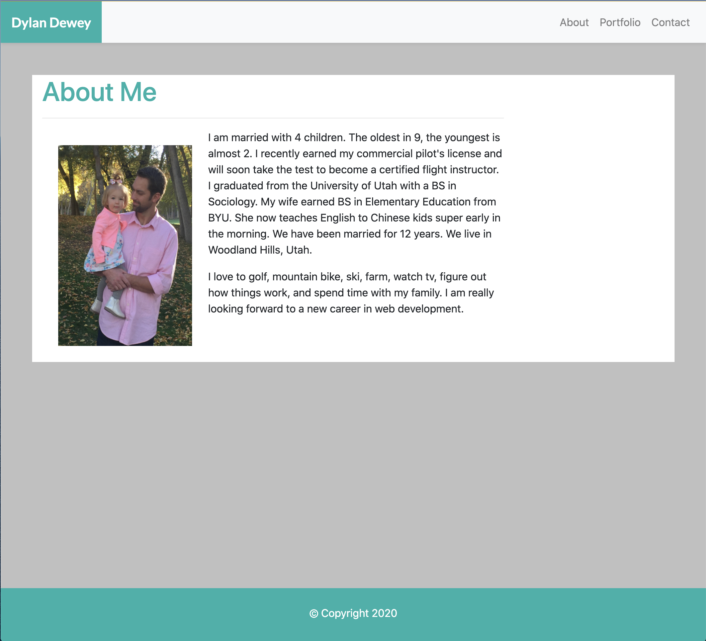
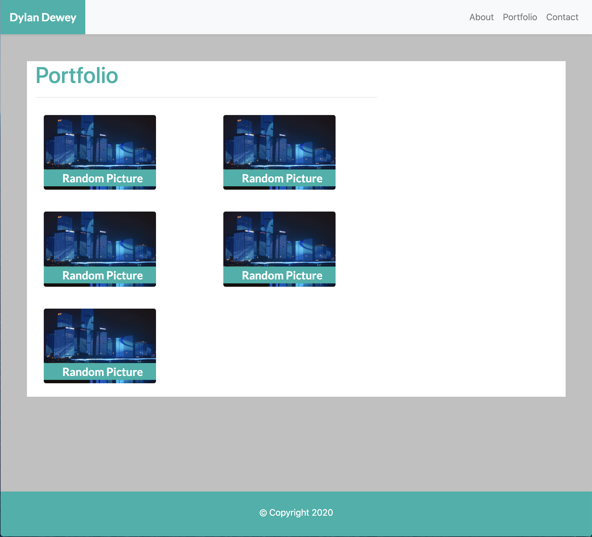
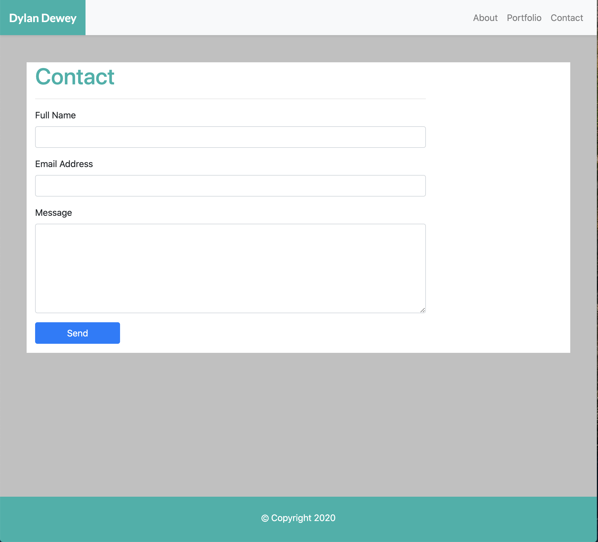

# Responsive-Portfolio
This assignment was tough for me.  I initially started making the pages from scratch using only columns and rows.  I used this for the Navbar and everything else.  Then when people started asking questions about the homework, I saw they were using much more than just columns and rows from bootstrap.  So I made some major changes and incorporated more bootstrap.  It was quite overwhelming and frustrating.  I then met with a tutor who gave me even more tips on ways I can use bootstrap and best practices.  After I met with the tutor and many hours spent with my group I feel much more comfortable with Bootstrap and not as overwhelmed and discouraged.  

https://dylandewey.github.io/Responsive-Portfolio/

